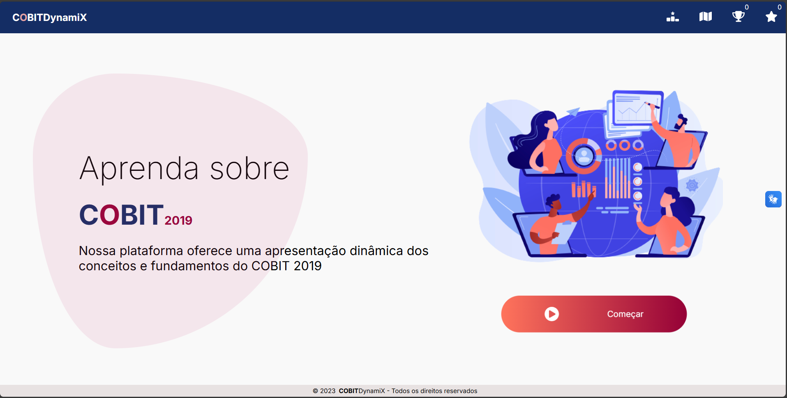
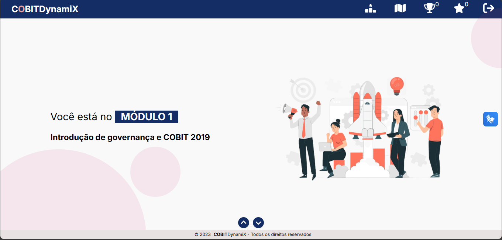
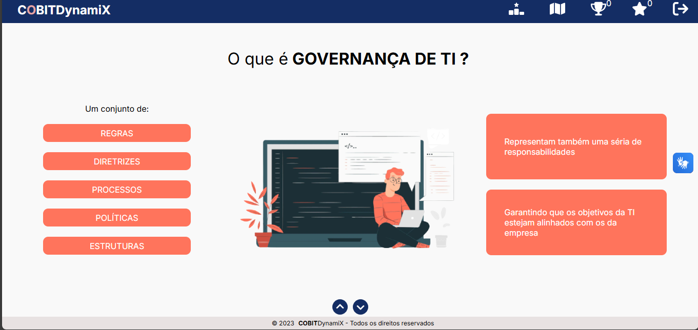
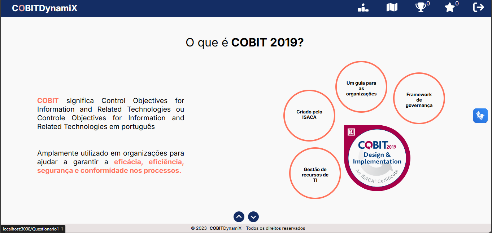
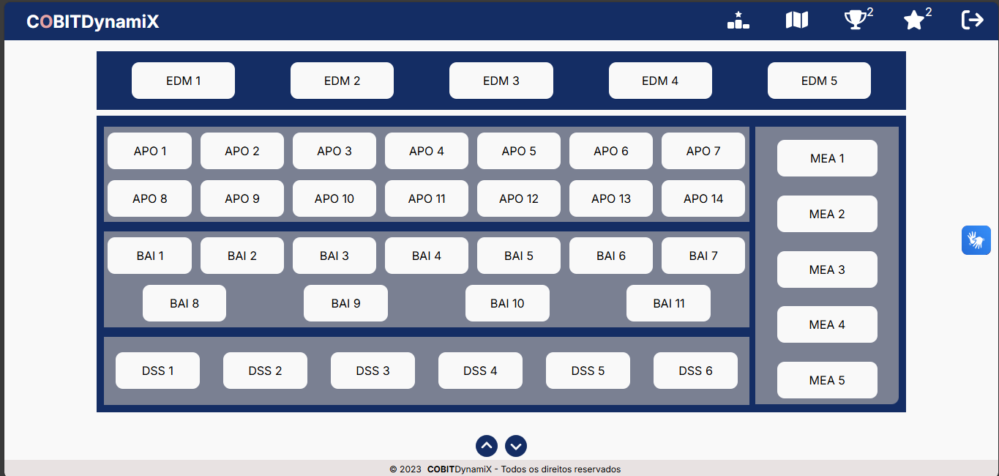
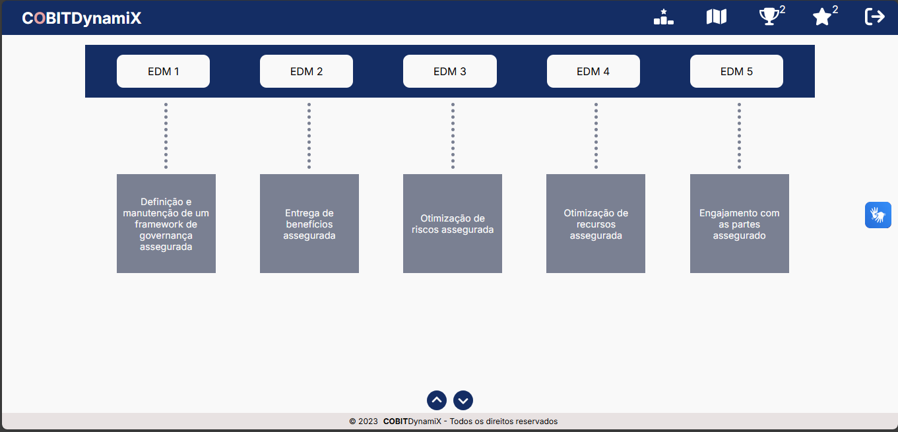
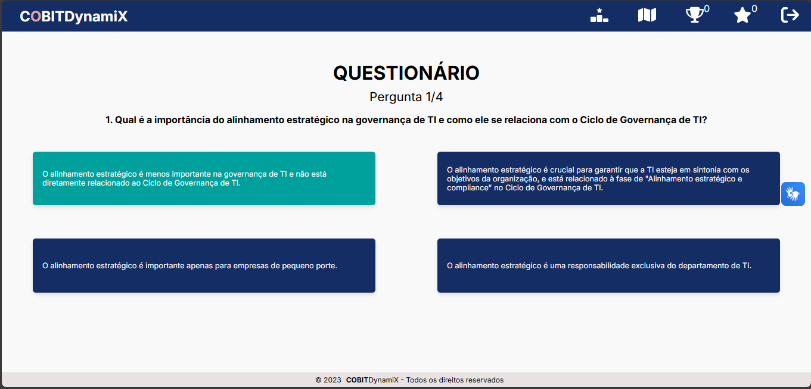
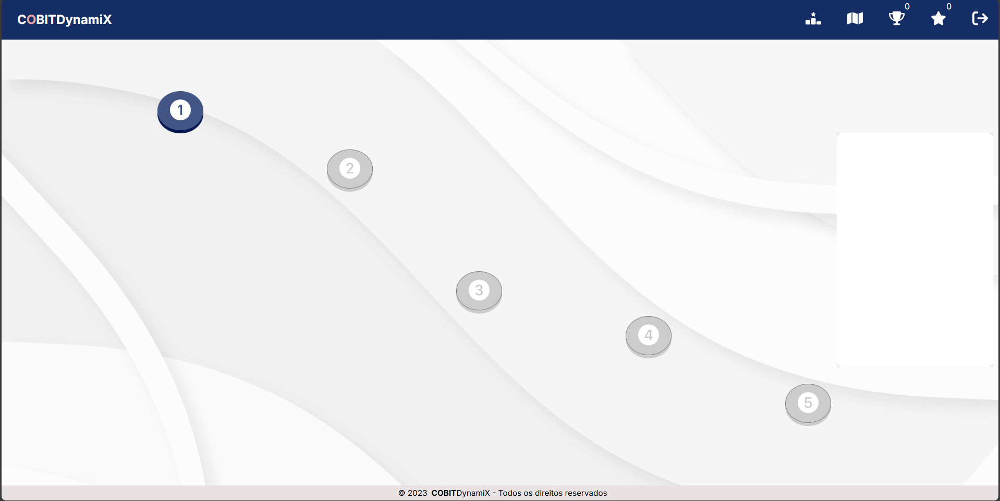

# COBITDynamiX

Nossa plataforma oferece uma apresentação dinâmica dos conceitos e fundamentos do COBIT 2019.

### 💡 Sobre o Projeto

O **COBITDynamiX** é uma plataforma educacional inovadora, desenvolvida para simplificar o aprendizado dos conceitos e fundamentos do **COBIT 2019** (Control Objectives for Information and Related Technologies).

Utilizando uma abordagem de **gamificação**, similar ao estilo intuitivo e engajador do Duolingo, transformamos o estudo em uma experiência interativa e motivadora.

**Principais Funcionalidades:**

* **Conteúdo Estruturado:** O material é dividido em **5 módulos** de aprendizado, que cobrem os fundamentos do COBIT 2019.
* **Mapa de Progresso:** Os módulos são desbloqueados sequencialmente em um mapa, incentivando o avanço contínuo.
* **Aulas Interativas:** O conteúdo é apresentado de forma simples e intuitiva, facilitando a compreensão.
* **Questionários de Avaliação:** Ao final de cada módulo, há um questionário de múltipla escolha para testar o conhecimento adquirido.
* **Sistema de Recompensas e Pontuação:**
    * **Troféus:** Um troféu é concedido ao usuário após a conclusão e aprovação no questionário de cada módulo.
    * **Estrelas:** O usuário ganha uma estrela para cada questão respondida corretamente.
    * **Ranking:** Uma seção de ranking permite que os usuários vejam sua pontuação e comparem seu desempenho com o de outros, fomentando a competição saudável.

### 💻 Tecnologia

O projeto foi desenvolvido utilizando **React**, uma biblioteca JavaScript para a construção de interfaces de usuário, garantindo uma aplicação moderna, rápida e responsiva.

### 🖼️ Imagens do Projeto
#### Home


#### Módulo 1




#### Tabela de Objetivos do COBIT 2019



#### Questionário


#### Mapa


### 🚀 Como Rodar o Projeto

Siga os passos abaixo para configurar e rodar o **COBITDynamiX** em seu ambiente local.

**Pré-requisitos:**

* Node.js (versão recomendada: 18.x ou superior)
* npm (gerenciador de pacotes do Node.js)

```bash
git clone https://github.com/ViviFerreira/cobit.git
npm install
npm start
```

Abra seu navegador e navegue até a URL local para começar a explorar e aprender sobre o COBIT 2019!
